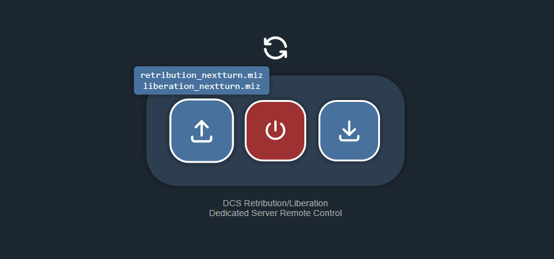

# DCS Retribution/Liberation Server Remote Control

This is an application to simplify hosting Retribution/Liberation missions on **DCS Dedicated Severs**.

It runs on you dedicated server machine and allows users to remotely control the server via a simple web interface.  
You can...
- ⬆️ Upload the mission files each turn
- 🟢 Start/Stop the server
- ⬇️ Download the mission results back to your local machine for next turn

With this you can allow multiple people in your squadron/group to host Retribution/Liberation missions on your dedicated server, without needing to give them full control of the server machine.

### Integration
I am also considering (if possible) integrating the remote control API directly into Retribution, instead of requiring users to open their web browser.  
If you find this useful, please leave a star ⭐ on this repository so that I know there is indeed a need for this application.

## Setup
### Pre-requisites
You need to have an already working DCS server, with all the necessary server settings in place (e.g. server name, password, resume mode, etc.).

This application will modify the existing server settings to run the uploaded missions.

### Configuration
1. Download the [**latest release**](https://github.com/omltcat/dcs-retribution-remote/releases/latest/) and extract to somewhere on your server.
2. Open the `config.yaml` and change the following:
    - 📁 `dcs_mission_dir`: The folder you put mission files, usually in `Saved Games`
    - ⚙️ `dcs_server_exe`: The path to `dcs_server_exe`
    - 👤 Modify/add your list of usernames and passwords.  
    They will be used for web interface login.  
    You can give each user their own credentials to track who used the server and when.
    - The rest of the configs are optional, and should be self-explanatory.
3. Expose this application over the web for remote access.  
Possible options are:
    

    
‼️ (Very insecure!) Plain HTTP Access 

    Open TCP port 9099 (default) on your server firewall and (if applicable) port forward it on your router.

    - User will access the web interface via `http://<your-server-ip>:9099`
    - Please read the [Security](#security) section below on why this is a bad idea.
    

    

    
👍 (Better) Self-signed HTTPS

    Set `https` to `true` in the `config.yaml`, and do the same firewall/port forwarding setting as above.
    - User will access the web interface via `https://<your-server-ip>:9099` (not `http`)
    - Since it uses a self-signed certificate (instead of a real domain), you will get a warning in your browser. You can let your user know that it is okay to ignore this warning and click  
    **Advanced** > **Proceed**.
    

    
 
    
✅ (Best) HTTPS with Reverse Proxy

    Use a reverse proxy (e.g. Caddy, Nginx) to expose the web interface over HTTPS.  
    - If you have no idea what I am talking about, the easiest way is to use [Cloudflare tunnel](https://developers.cloudflare.com/cloudflare-one/connections/connect-networks/get-started/create-remote-tunnel/)  
        - A very concise [video tutorial](https://www.youtube.com/watch?v=UR2lMDnqw2w)
    - You will need to register for a real domain name, which can be very cheap these days (less than $10/year). I recommend [Porkbun](https://www.porkbun.com/) for this, or you can just use [Cloudflare](https://domains.cloudflare.com/) to simplify the process.
    

    

    
🌐 (Alternative) virtual network

    You can set up a virtual network among the people who need to access the remote control interface (not needed for all players)
    - Popular options are (both are free for personal use):
        [ZeroTier](https://www.zerotier.com/) or [Tailscale](https://tailscale.com/)/
    - This allows them to access via private IP address, and you don't need to expose the server to the internet at all.
    

Now run `retribution_remote.exe`. It should pick up the configs and start the web server.

If you see any errors that you cannot resolve with proper configs, please [open an issue](https://github.com/omltcat/dcs-retribution-remote/issues).

 ## Usage
 ### Requirements
Users need to run DCS Retribution/Liberation on their own PC to manage the campaign and generate missions.

### Mission Workflow
 1. 🛫 In Retribution/Liberation, when you are done setting up a turn, hit `TAKE OFF`
    - The mission file (`retribution_nextturn.miz` or `liberation_nextturn.miz`) should be generated in your DCS Missions folder.
2. ⬆️ Upload this mission file to the server using your web browser.
3. 🟢 Start the server. This may take a while. The button will turn green when the server is running.
    - Wait a minute or two and join the DCS server.
    - If your server needs to be un-paused manually, you can do so using the multiplayer chat box:
        - ▶️ send `/resume` to un-pause the mission
        - ⏸️ send `/pause` to pause the mission if needed
        - (A small scripted is auto-injected to enable this)
4. 🔴 When the mission is over, stop the server on the web interface.
5. ⬇️ Download the `state.json` file back to your local machine.
6. ✋ Use Manual Submit in Retribution/Liberation to process the results.

## Security
There is a good reason why I urged you to run expose this application securely. When you expose the web interface over HTTP (not HTTPS), the login credentials are sent over the internet **in plain text**. 

In case you don't know, the Lua scripts in a DCS mission can run any arbitrary code, including direct access to your machine. If a malicious actor gets access to your server, they can pretty much do anything they want. There is no way to determine if the uploaded mission file is safe or not. 

Even worse, when players join the server, they will also download the mission (in the form of a track file) to their own machines. You can get your entire squadron hacked if you are careless.